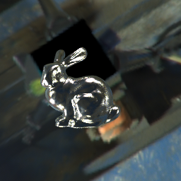
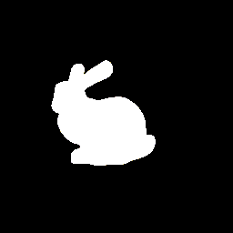
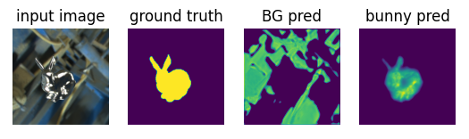

# u-net-starter

Starter code for U-Net model (Ronneberger 2016). Contains a dataset with a metal stanford bunny, where U-Net is tasked to create a segmenentation of the bunny and the background. The bunny is given a metal texture, and images are taken from random positions around it. The images are 3 channel png images with 256x256 pixels. An example is shown below:

with corresponding ground truth:

One prediction each epoch is saved in the plots directory as such

